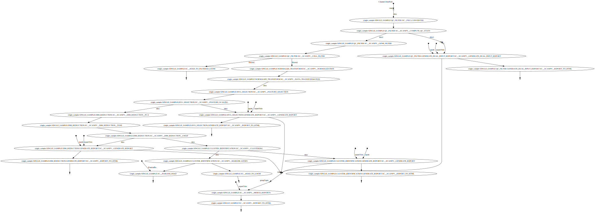
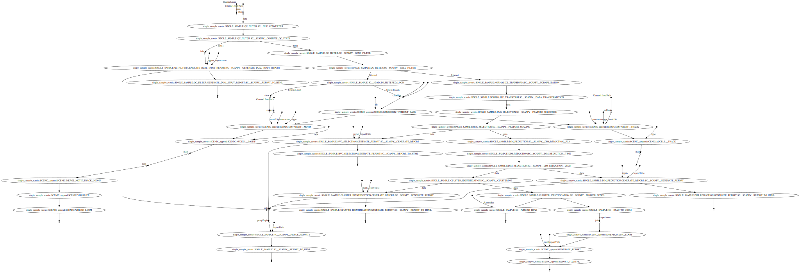
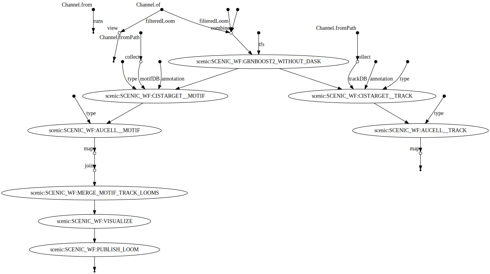
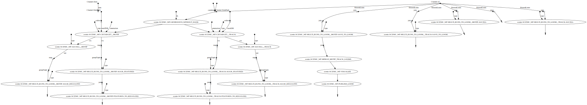
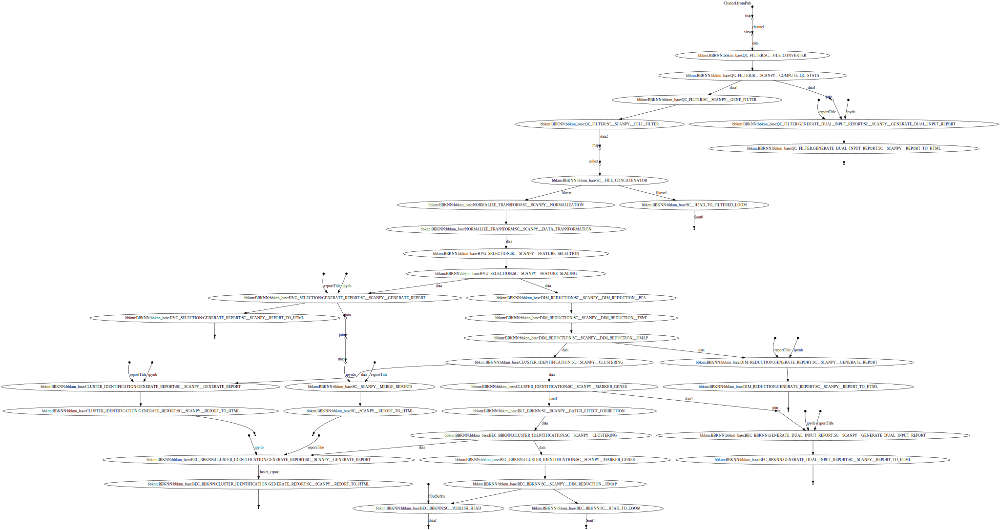
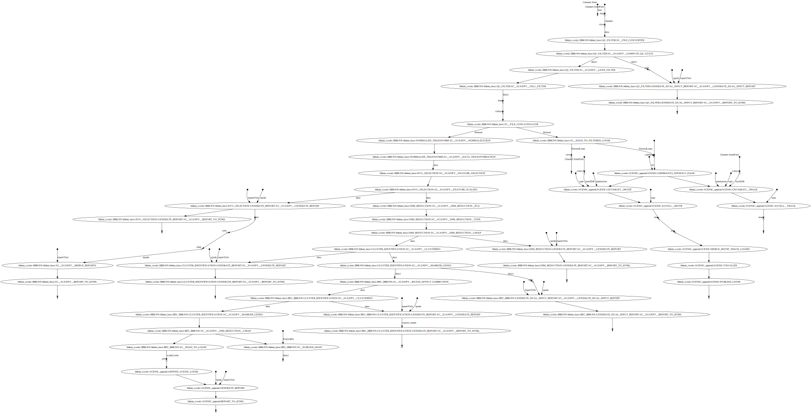

# vib-singlecell-nf

[](https://www.nextflow.io/)

A repository of pipelines for single-cell data in Nextflow DSL2.

All the output generated by the pipelines will be located in the directory specified by `params.global.outdir` in `nextflow.config`.

# Dependencies

Make sure you have the following softwares installed,
- [Nextflow](https://www.nextflow.io/)
* A container system, either of:
    * [Docker](https://docs.docker.com/)
    * [Singularity](https://www.sylabs.io/singularity/)

# Quick start

To run a quick test of the single sample analysis pipeline, we can use the 1k PBMC datasets provided by 10x Genomics.
This will take only **~3min** to run.

1. The data first needs to be downloaded (instructions can be found 
    [here](data/README.md)).

2. Next, a config file needs to be generated.
In your working directory, run `nextflow config ...` with the appropriate profiles:
```bash
nextflow config vib-singlecell-nf/vib-singlecell-nf \
    -profile tenx,singularity,single_sample > single_sample.config
```
Now, edit `single_sample.config`.
Most of the default values are already set for the test dataset, but certain variables (e.g. container links) may need to be changed.
In particular, `params.data.tenx.cellranger_outs_dir_path` should point to the `outs/` folder generated by CellRanger, and
    `params.sc.file_converter` should be a path to the sample metadata file.

3. The pipeline can be run using the config file just generated (`-C ...`), and specifying the `single_sample` workflow as an entrypoint:
```bash
nextflow -C single_sample.config \
   run vib-singlecell-nf/vib-singlecell-nf \
      -entry single_sample
```

The pipelines will generate 3 types of results in the output directory (`params.global.outdir`) 
- `data`: contains all the intermediate files.
- `loom`: contains final loom files which can be imported inside SCope visualization tool for further insight of the results.
- `notebooks`: contains all the notebooks generated along the pipeline (e.g.: Quality control report)
    - See the example output report from the 1k PBMC data 
      [here](notebooks/10x_PBMC.merged_report.html).
- `pipeline_reports` (if `-profile report` was passed to `nextflow config ...`)

If you would like to use the pipelines on a custom dataset, please go to the `Pipelines` section (see below).

# Pipelines

## General workflow and strategy
### Running the pipeline directly from GitHub:
The intended usage for this pipeline is for the code to be run directly from GitHub.
This results in a separation of the Nextflow code and the results stored in the working directory.
For example:
```bash
nextflow run vib-singlecell-nf/vib-singlecell-nf \
    -profile singularity,single_sample \
    -entry single_sample
```
This picks up `vib-singlecell-nf/vib-singlecell-nf/main.nf` and runs the workflow defined by the `-entry` setting (here, `single_sample`), using the built-in configs, which are merged from each tool used (defined in the `single_sample` profile).
Specifying `nextflow run -latest ...` will download the latest commit prior to execution, or the `-r ...` option can be used to specify a specific commit or branch.
However, in nearly all cases it will be necessary to run the pipeline with a customized config file.

### Running the pipeline with a customized config file
The recommended method is to first run `nextflow config ...` to generate a complete config file (with the default parameters) in your working directory.
The tool-specific parameters, as well as Docker/Singularity profiles, are included when specifying the appropriate profiles to `nextflow config`.
Any of the parameters in this config file can then be edited and used to run the workflow of your choice.
For example, to run the `single_sample` workflow in a new working directory using the `singularity` profile:

1. Generate the config using the `single_sample` and `singularity` profiles:
```bash
mkdir single_sample_test && cd single_sample_test

nextflow config vib-singlecell-nf/vib-singlecell-nf \
    -profile tenx,singularity,single_sample > single_sample.config
```
2. Now run the workflow using the new config file (using `-C` to use **only** this file), specifying the proper workflow as the entry point:
```bash
nextflow -C single_sample.config \
   run vib-singlecell-nf/vib-singlecell-nf \
      -entry single_sample
```

## Single-sample Datasets
Pipelines to run a single sample or multiple samples separately.

### `single_sample`


The **single_sample** workflow will process 10x data,taking in 10x-structured data, and metadata file.
The standard analysis steps are run: filtering, normalization, log-transformation, HVG selection, dimensionality reduction, clustering, and loom file generation.
The output is a loom file with the results embedded.

<details>
    <summary>Click here to see the DAG of the workflow</summary>



</details>

### `single_sample_scenic`


Runs the `single_sample` workflow above, then runs the SCENIC workflow on the output, generating a comprehensive loom file with the combined results.
This could be very resource intensive, depending on the dataset.

<details>
    <summary>Click here to see the DAG of the workflow</summary>



</details>

### `scenic`


Runs the SCENIC workflow alone, generating a loom file with only the SCENIC results.

<details>
    <summary>Click here to see the DAG of the workflow</summary>



</details>

### `scenic_multiruns`
Runs the SCENIC workflow multiple times (set by `params.sc.scenic.numRuns`), generating a loom file with the aggregated results from the multiple SCENIC runs.

<details>
    <summary>Click here to see the DAG of the workflow</summary>



</details>

### `cellranger`
Runs the cellranger workflow (`makefastq`, then `count`).
Input parameters are specified within the config file:
* `params.sc.cellranger.mkfastq.csv`: path to the CSV samplesheet
* `params.sc.cellranger.mkfastq.runFolder`: path of Illumina BCL run folder
* `params.sc.cellranger.count.transcriptome`: path to the Cell Ranger compatible transcriptome reference

### `nemesh`
Runs the Nemesh pipeline (Drop-seq) on a single sample or multiple samples separately.

Source: http://mccarrolllab.org/wp-content/uploads/2016/03/Drop-seqAlignmentCookbookv1.2Jan2016.pdf

## Multiple Datasets
Pipelines to aggregate multiple datasets together.

### `bbknn`


Runs the BBKNN pipeline (sample-specific filtering, merging of individual samples, normalization, log-transformation, HVG selection, PCA analysis, then the batch-effect correction steps: BBKNN, clustering, dimensionality reduction (UMAP only)).
The output is a loom file with the results embedded.

Source: https://github.com/Teichlab/bbknn/blob/master/examples/pancreas.ipynb

<details>
    <summary>Click here to see the DAG of the workflow</summary>



</details>

### `bbknn_scenic`
Runs the `bbknn` workflow above, then runs the SCENIC workflow on the output, generating a comprehensive loom file with the combined results.
This could be very resource intensive, depending on the dataset.

<details>
    <summary>Click here to see the DAG of the workflow</summary>



</details>

## Information on using 10xGenomics datasets

Let's say the file structure of your data looks like this,

```
/home/data/
└── cellranger
    ├── Sample A
    │   └── outs
    │       ├── filtered_feature_bc_matrix
    │       └── ...
    └── Sample_B
        └── outs
            ├── filtered_feature_bc_matrix
            └── ...
```

Setting the input directory appropriately will collect all the samples listed in the `filtered_[feature|gene]_bc_matrix` directories listed above.
For example, in `params.data.tenx`, setting:
```
cellranger_outs_dir_path = "/home/data/cellranger/Sample*/outs/"
```
will recursively find all 10x samples in that directory.

# Docs

## Define input data

Depending on the type of data you run the pipeline with, one or more appropriate profiles should be set when running `nextflow config`.

### Cell Ranger (10xGenomics)
```
-profiles tenx
```
In the generated .config file, make sur the `cellranger_outs_dir_path` parameter is set with the paths to the Cell Ranger `outs` folders:
```
[...]
tenx {
    cellranger_outs_dir_path = "data/10x/1k_pbmc/1k_pbmc_*/outs/"
}
[...]
```
- The `cellranger_outs_dir_path` parameter accepts glob patterns and also comma separated paths.

### H5AD (Scanpy)
```
-profiles h5ad
```

In the generated .config file, make sur the `file_paths` parameter is set with the paths to the `.h5ad` files:
```
[...]
h5ad {
    file_paths = "data/1k_pbmc_v*_chemistry_SUFFIX.SC__FILE_CONVERTER.h5ad"
    suffix = "_SUFFIX.SC__FILE_CONVERTER.h5ad"
}
[...]
```
- The `suffix` parameter is used to infer the sample name from the file paths.
- The `file_paths` accepts glob patterns and also comma separated paths.
Make sure that `sc.file_converter.iff` is set to `h5ad`.

## Select the optimal number of principal components

When generating the config using `nextflow config` (see above), add the `pcacv` profile.

Remarks:
- Make sure `nComps` config parameter (under `dim_reduction` > `pca`) is not set.
- If `nPcs` is not set for t-SNE or UMAP config entries, then all the PCs from the PCA will be used in the computation.

Currently, only the Scanpy related pipelines have this feature implemented.

## Cell-based metadata annotation

If you have (pre-computed) cell-based metadata and you'd like to add them as annotations, please read [cell-based metadata annotation](https://github.com/vib-singlecell-nf/vib-singlecell-nf/tree/develop/src/utils#cell-based-metadata-annotation).

## Sample-based metadata annotation

If you have sample-based metadata and you'd like to annotate the cells with these annotations, please read [sample-based metadata annotation](https://github.com/vib-singlecell-nf/vib-singlecell-nf/tree/develop/src/utils#sample-based-metadata-annotation).

## Multi-sample parameters

It's possible to define custom parameters for the different samples. It's as easy as defining a hashmap in groovy or a dictionary-like structure in Python.
You'll just have to repeat the following structure for the parameters which you want to enable the multi-sample feature for:

```
params {
    sc {
        scanpy {
         container = 'aertslab/sctx-scanpy:0.5.0'
         filter {
            report_ipynb = '/src/scanpy/bin/reports/sc_filter_qc_report.ipynb'
            // Here we enable the multi-sample feature for the cellFilterMinNgenes parameter
            cellFilterMinNGenes = [
                '1k_pbmc_v2_chemistry': 600,
                '1k_pbmc_v3_chemistry': 800
            ]
            // cellFilterMaxNGenes will be set to 4000 for all the samples
            cellFilterMaxNGenes = 4000
            // Here we again enable the multi-sample feature for the cellFilterMaxPercentMito parameter
            cellFilterMaxPercentMito = [
                '1k_pbmc_v2_chemistry': 0.15,
                '1k_pbmc_v3_chemistry': 0.05
            ]
            // geneFilterMinNCells will be set to 3 for all the samples
            geneFilterMinNCells = 3
            iff = '10x_mtx'
            off = 'h5ad'
            outdir = 'out'
         }
    }
}
```

# Development

## Repository structure

### Root
The repository root contains a `main.nf` and associated `nextflow.config`.
The root `main.nf` imports and calls sub-workflows defined in the modules.

### Modules
A "module" consists of a folder labeled with the tool name (Scanpy, SCENIC, utils, etc.), with subfolders for
* `bin/` (scripts passed into the container)
* `processes/` (where Nextflow processes are defined)
The root of the modules folder contains workflow files + associated configs (as many as there are workflows):
* `main.nf` + `nextflow.config`
* `single_sample.nf` + `scenic.config`
* ...

```
src/
├── cellranger
│   ├── main.nf
│   ├── nextflow.config
│   └── processes
│       ├── count.nf
│       └── mkfastq.nf
│
├── channels
│   └── tenx.nf
│
├── scenic
│   ├── bin
│   │   ├── grnboost2_without_dask.py
│   ├── processes
│   │   ├── aucell.nf
│   │   ├── cistarget.nf
│   │   ├── grnboost2withoutDask.nf
│   ├── main.nf
│   └── scenic.config
│
└── utils
    ├── bin
    │   ├── h5ad_to_loom.py
    │   ├── sc_file_concatenator.py
    │   └── sc_file_converter.py
    ├── utils.config
    └── processes
        ├── files.nf
        ├── h5ad_to_loom.nf
        ├── utils_1.test.nf
        ├── utils_2.test.nf
        └── utils.nf
```

### Workflows

Workflows (chains of nf processes) are defined in the module root folder (e.g. [src/Scanpy/bec_bbknn.nf](https://github.com/vib-singlecell-nf/vib-singlecell-nf/blob/module_refactor/src/scanpy/bec_bbknn.nf))
Workflows import multiple processes and define the workflow by name:
```groovy
include SC__CELLRANGER__MKFASTQ from './processes/mkfastq'  params(params)
include SC__CELLRANGER__COUNT   from './processes/count'    params(params)

workflow CELLRANGER {

    main:
        SC__CELLRANGER__MKFASTQ(file(params.sc.cellranger.mkfastq.csv), path(params.sc.cellranger.mkfastq.runFolder))
        SC__CELLRANGER__COUNT(file(params.sc.cellranger.count.transcriptome), SC__CELLRANGER__MKFASTQ.out.flatten())
    emit:
        SC__CELLRANGER__COUNT.out

}

```

#### Workflow imports
Entire **sub-workflows** can also be imported in other workflows with one command (inheriting all of the process imports from the workflow definition):
```groovy
include CELLRANGER from '../cellranger/main.nf' params(params)
```

This leads to the ability to easily define **high-level workflows** in the master nf file: `vib-singlecell-nf/vib-singlecell-nf/main.nf`:
```groovy
include CELLRANGER from './src/cellranger/main.nf' params(params)
include BEC_BBKNN from './src/scanpy/bec_bbknn.nf' params(params)
include SCENIC from './src/scenic/main.nf' params(params)

workflow {

    CELLRANGER()
    BEC_BBKNN( CELLRANGER.out )
    SCENIC( BEC_BBKNN.out )

}
```


### Parameters structure
Parameters are stored in a separate config file per workflow, plus the main `nextflow.config`. 
These parameters are merged when starting the run using e.g.:
```groovy
includeConfig 'src/scenic/nextflow.config'
```

The parameter structure internally (post-merge) is:
```groovy
params {
    global {
        baseFilePath = "/opt/vib-singlecell-nf"
        project_name = "MCF7"
        ...
    }
    sc {
        utils {
            file_converter {
                ...
            }
            file_annotator {
                ...
            }
            file_concatenator {
                ...
            }
        }
        scanpy {
            container = 'docker://aertslab/sctx-scanpy:0.5.0'
            filter {
                ...
            }
            data_transformation {
                ...
            }
            normalization {
                ...
            }
            feature_selection {
                ...
            }
            feature_scaling {
                ...
            }
            dim_reduction {
                pca {
                    dimReductionMethod = 'PCA' 
                    ...
                }
                umap {
                    dimReductionMethod = 'UMAP' 
                    ...
                }
            }
            batch_effect_correct {
                ...
            }
            clustering {
                ...
            }
        }
    }
}

```

## Module testing

Modules and processes can be tested independently, you can find an example in `src/utils/main.test.nf`.

The `SC__FILE_CONVERTER` process is tested against the `tiny` dataset available in `data/01.count`.

