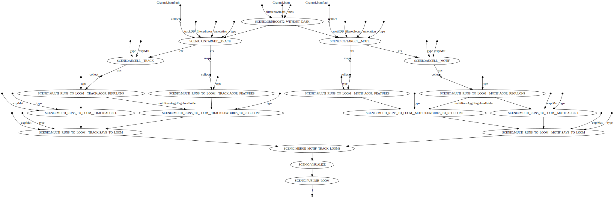

# SCENIC

## Running the pipeline

### Generate the config file

- Single SCENIC run

*Note*: The `qsub` profile if you are not running the pipeline on a cluster.

```{bash}
nextflow config \
   -profile hg38,scenic,scenic_use_cistarget_motifs,scenic_use_cistarget_tracks,qsub,singularity vib-singlecell-nf/vsn-pipelines
```

- Multi-runs SCENIC

*Note*: Omit the `qsub` profile if you are not running the pipeline on a cluster.

```{bash}
nextflow config \
   -profile hg38,scenic,scenic_use_cistarget_motifs,scenic_use_cistarget_tracks,qsub,singularity vib-singlecell-nf/vsn-pipelines
```

### Update the config file

Make sure the following parameters are correctly set:
- `params.global.project_name`
- `params.global.qsubaccount` if running on a cluster (SGE cluster)
- `params.tools.scenic.filteredLoom`
- `params.tools.scenic.grn.tfs`
- `params.tools.scenic.cistarget.motifsDb`
- `params.tools.scenic.cistarget.motifAnnotation`
- `params.tools.scenic.cistarget.tracksDb` if commented, track-based cisTarget won't run
- `params.tools.scenic.cistarget.tracksAnnotation` if commented, track-based cisTarget won't run
- `params.tools.scenic.numRuns` if running SCENIC in multi-runs mode
- `singularity.runOptions` Specify the paths to mount
- `params.sc.scope.tree`

Additionally, you can update the other paraemeters for the different steps.

### Run 

```{bash}
nextflow -C nextflow.config run \
   vib-singlecell-nf/vsn-pipelines \
      -entry scenic \
      -with-report report.html \
      -with-trace
```

### Miscellaneous

Here is the DAG summarizing the multi-runs SCENIC workflow:



## Testing the pipeline

```{bash}
nextflow config \
   -profile scenic,scenic_test,qsub,singularity vib-singlecell-nf/vsn-pipelines \
   > nextflow.config
nextflow -C nextflow.config run main.nf --test
```
